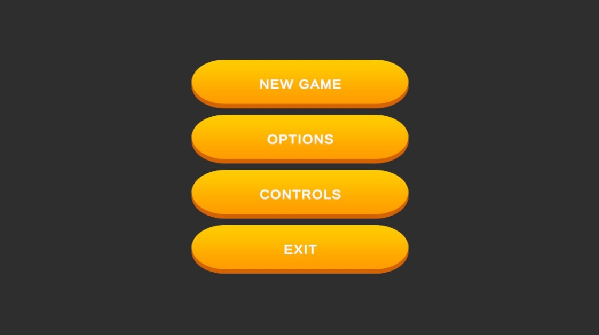
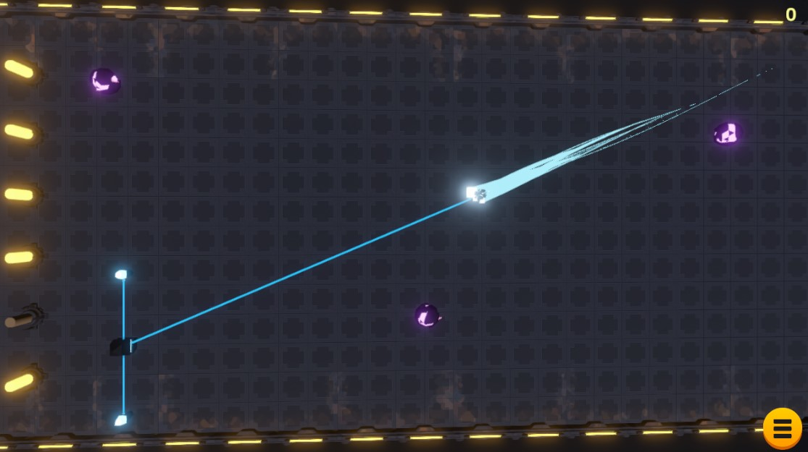

# MobileGame

## About
Simple mobile game made in Unity (2020.1.9f1 version). Player goal is to destroy asteroids flying towards the core cells with a magnetic ball which player can pull towards him and throw when catched. For each destroyed asteroid player get some score and increast current combo, which resets after short period of time, if none asteroid was destroyed during that time. Higher combo grant better score multiplayer. the combo can be also reseted when one of the core cell is destroy or if the ball exit the play ground.

## Used packages and assets
* [FMOD for audio](https://assetstore.unity.com/packages/tools/audio/fmod-for-unity-161631)
* [Cool Visual Effects - Part 1 - URP Support](https://assetstore.unity.com/packages/vfx/particles/cool-visual-effects-part-1-urp-support-176571)
* [Simple Button Set 01 for UI](https://assetstore.unity.com/packages/2d/gui/icons/simple-button-set-01-153979)
* [Low Poly Space Rocks for player and asteroid](https://assetstore.unity.com/packages/3d/environments/sci-fi/low-poly-space-rocks-58385)
* [Sanctuary for enviroment](https://assetstore.unity.com/packages/3d/environments/sci-fi/sanctuary-62519)
* [Sherbb's Particle Collection for visual effects](https://assetstore.unity.com/packages/vfx/particles/sherbb-s-particle-collection-170798)
* [Epic Game Hits SFX](https://assetstore.unity.com/packages/audio/sound-fx/epic-game-hits-sfx-36617)
* [Free Fireworks - Fire FX - Nova Sound](https://assetstore.unity.com/packages/audio/sound-fx/free-fireworks-fire-fx-nova-sound-39475)
* [Future City Free](https://assetstore.unity.com/packages/audio/music/electronic/electronic-future-city-free-21756)
* [Ultra Sci-Fi Game Audio Weapons Pack Vol. 1](https://assetstore.unity.com/packages/audio/sound-fx/weapons/ultra-sci-fi-game-audio-weapons-pack-vol-1-113047)

## Screenshots

### MainMenu

### Gameplay

